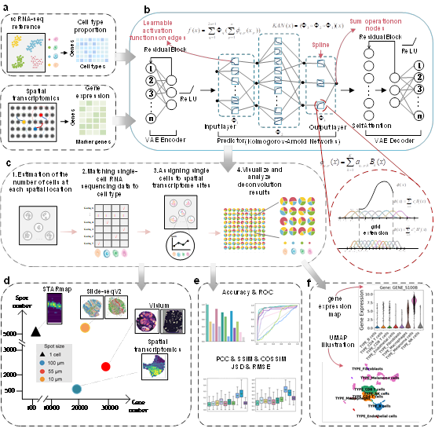

[](https://kancell.readthedocs.io/en/latest/?badge=latest)


# KanCell: Augmented Dissection of Cellular Heterogeneity in Biological Tissues through Integrated Single-Cell and Spatial Transcriptomics




## Getting Started
* [Requirements](#Requirements)

* Tutorials
    * [Deconvolution of cell type composition in human heart dataset](docs/tutorials/human_heart.ipynb)
    * [Deconvolution of cell type composition in melanoma dataset](docs/tutorials/melanoma.ipynb)
    * [Deconvolution of cell type composition in STARmap dataset](docs/tutorials/STARmap.ipynb)

    
## Requirements
**Note**: The current version of KanCell is only compatible with Linux and macOS, and does not support Windows.

To install `KanCell`, you must first install [PyTorch](https://pytorch.org) with GPU support. If GPU acceleration is not required, you can skip the installation of `cudnn` and `cudatoolkit`.
* Create a conda environment for `KanCell`:
```
conda env create -f environment.yml
```
or
```
conda create -n KanCell -c conda-forge -c default cudatoolkit=10.2 python=3.8 rpy2 r-base r-fitdistrplus
```
You must choose correct `PyTorch`, `cudnn` and `cudatoolkit` version dependent on your graphic driver version. 
